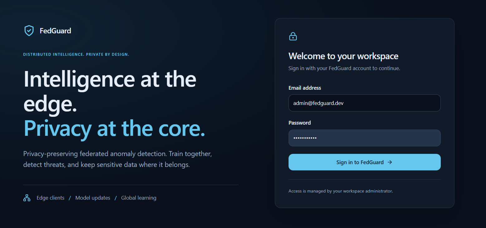
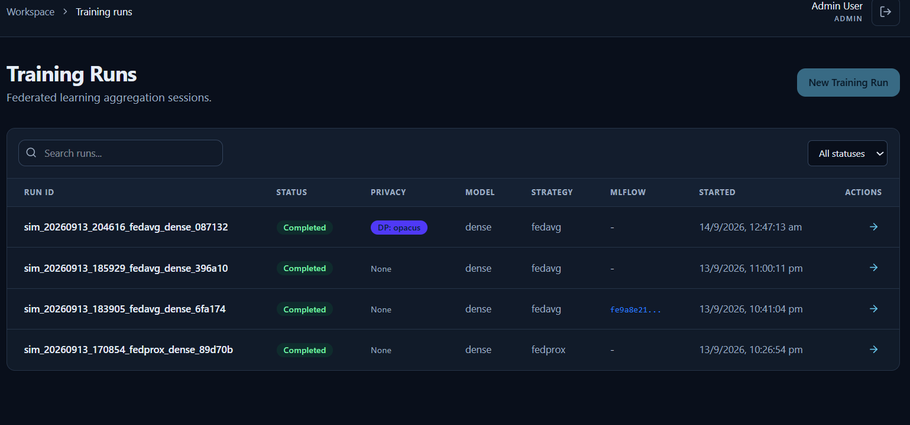
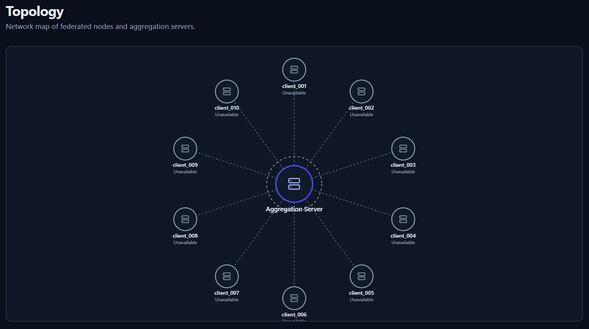
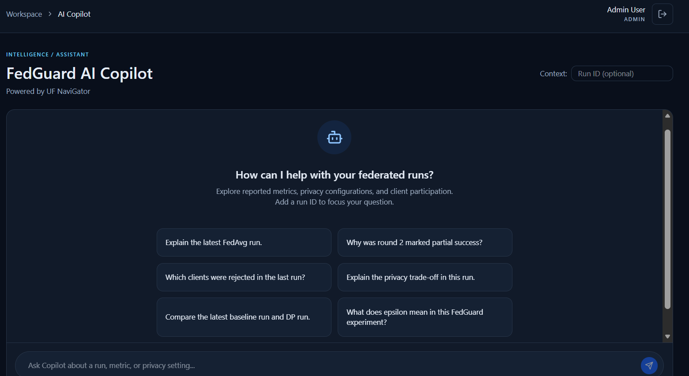
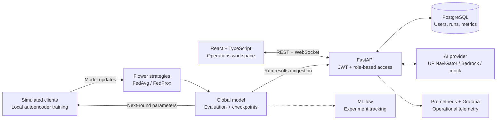

<div align="center">

# FedGuard

### Distributed Intelligence. Private by Design.

Privacy-preserving federated anomaly detection.<br />
A full-stack workspace for training across simulated organizations, inspecting model behavior, and understanding the privacy–utility trade-off.

<p>
  
  
  
  
  
</p>

[Explore the platform](#the-platform) · [Architecture](#architecture) · [Run locally](#run-locally) · [Technical docs](#technical-docs)

</div>



## Why FedGuard?

Anomaly detection benefits from diverse data. Centralizing that data can introduce privacy, ownership, and operational constraints.

FedGuard explores an alternative: **train models locally and combine their updates into a shared global model.** It brings the learning pipeline and the operational interface into one project—from client participation and round metrics to differential privacy and AI-assisted analysis.

The project uses simulated organizations and the ToN-IoT network-traffic dataset. It is an engineering and research demonstration, not a production intrusion-detection service.

## The platform

| Capability | What you can explore |
| :--- | :--- |
| **Federation overview** | Training progress, client health, anomaly volume, and reported model metrics. |
| **Training runs** | FedAvg/FedProx runs, round-level results, reconstruction loss, and privacy configuration. |
| **Edge clients & topology** | Client inventory, participation, and a visual map of the federation. |
| **Privacy experiments** | Opacus-based DP-SGD, clipping, noise, and privacy-budget reporting. |
| **AI Copilot** | Ask about runs and privacy settings through the configured LLM provider, including an OpenAI-compatible UF NaviGator integration. |
| **Access & observability** | JWT authentication, role-based access, WebSocket training updates, MLflow integration, and Prometheus/Grafana tooling. |

### A closer look

**Training history** — inspect strategies, privacy modes, and completed runs.



<details>
<summary><strong>View network topology and AI Copilot</strong></summary>

<br />

**Network topology**



**AI Copilot**



</details>

Screenshots illustrate the interface; displayed records and availability depend on the configured environment. The Model Registry is explicitly labeled as a sample catalog.

## Architecture



**Learning path:** client partitions → local training → update validation → aggregation → global evaluation.

**Application path:** authenticated browser → FastAPI → persisted run and client data → operational views.

The cloud deployment layout places CloudFront in front of an S3-hosted frontend and an EC2/Nginx/FastAPI backend, with PostgreSQL persistence. See the [AWS deployment guide](docs/AWS_DEPLOYMENT.md) for environment-specific setup.

## Engineering focus

- **Distributed training:** compare FedAvg and FedProx while recording per-round metrics and client participation.
- **Failure handling:** explore simulated dropouts, stragglers, invalid updates, and partial-round outcomes.
- **Privacy versus utility:** inspect how clipping and noise affect anomaly-detection performance.
- **Full-stack integration:** connect authenticated APIs, persistent experiment records, and live training events to a responsive React interface.
- **Operational visibility:** separate model tracking from API and federation telemetry.

### Stack

| Layer | Technologies |
| :--- | :--- |
| Interface | React, TypeScript, Vite, Tailwind CSS, Radix UI, Motion, TanStack Query, Recharts, Lucide |
| API & persistence | FastAPI, Pydantic, SQLAlchemy, Alembic, PostgreSQL |
| Learning & privacy | Flower, PyTorch, dense/transformer autoencoders, Opacus |
| Experiment tracking | MLflow |
| AI assistance | OpenAI-compatible client, UF NaviGator, optional Amazon Bedrock, development mock provider |
| Operations | Docker Compose, Prometheus, Grafana, GitHub Actions |
| Cloud architecture | CloudFront, S3, EC2, Nginx; optional AWS service integrations |

## Run locally

### Prerequisites

- Docker Desktop or Docker Engine with Compose.
- A reachable PostgreSQL database. The development Compose file does **not** provision one.
- Node.js 20+ and npm if running the frontend outside Docker.
- Python 3.12+ if running backend or ML tooling directly.

### 1. Clone and configure

```bash
git clone https://github.com/VISHNU07202003/FedGuard-Enterprise-Grade-Federated-Learning-Management-Platform.git
cd FedGuard-Enterprise-Grade-Federated-Learning-Management-Platform
```

Create `backend/.env` from the root `.env.example` **if it does not already exist**. The backend Compose service reads `backend/.env`, not a root `.env` file.

Set `DATABASE_URL` to your database connection using the `postgresql+asyncpg://` scheme, and set `JWT_SECRET` to a strong local secret. The example's `postgres` hostname is a template; replace it with a host reachable from the backend container. Keep local secrets out of version control.

For real API data, create `frontend/.env.development.local` with:

```dotenv
VITE_USE_MOCK_DATA=false
```

The checked-in development defaults enable mock data. This local override disables that mode without changing the shared defaults. It does not replace the Model Registry's separately labeled sample catalog.

### 2. Start the application

From the repository root:

```bash
# Build and start the API and frontend
docker compose up --build -d backend frontend

# Initialize or update the schema in your local development database
docker compose exec backend alembic upgrade head
```

Use an existing development account. Account provisioning is documented in [Authentication](docs/AUTHENTICATION.md); credentials are not published in this README. Starting the application does not automatically launch a training experiment or populate run history.

To start the complete configured stack, including the monitoring and federation services:

```bash
docker compose up --build -d
```

| Service | Local address |
| :--- | :--- |
| Frontend | [localhost:5173](http://localhost:5173) |
| API documentation | [localhost:8000/docs](http://localhost:8000/docs) |
| API health | [localhost:8000/health](http://localhost:8000/health) |
| MLflow · full stack | [localhost:5000](http://localhost:5000) |
| Prometheus · full stack | [localhost:9090](http://localhost:9090) |
| Grafana · full stack | [localhost:3000](http://localhost:3000) |

Use `localhost:5173` for the documented local frontend origin. Stop the services with `docker compose down`.

<details>
<summary><strong>Run the frontend directly with npm</strong></summary>

<br />

Start only the backend service, then run the frontend in another terminal. Do not also run the Compose frontend on the same port.

```bash
docker compose up --build -d backend
```

```bash
cd frontend
npm ci
npm run dev
```

Keep the `VITE_USE_MOCK_DATA=false` local override described above. The existing Vite proxy forwards `/api` requests to the local backend.

</details>

<details>
<summary><strong>Configure AI Copilot</strong></summary>

<br />

The provider is selected in `backend/.env`. For an OpenAI-compatible service, set `LLM_PROVIDER=openai`, `LLM_API_BASE`, `LLM_API_KEY`, and optionally `LLM_MODEL`. The current client defaults to `mistral-small-3.1` when no model is specified.

UF NaviGator requires authorized provider access. Keep the key on the backend; never place it in a `VITE_*` variable. The default mock provider is for development and does not demonstrate a live model response. Provider configuration changes require a backend restart/recreation.

See [AI Copilot](docs/BEDROCK_COPILOT.md) for the Bedrock-specific integration.

</details>

## Validation

Run frontend checks from `frontend/`:

```bash
npm run lint
npx tsc -b
npm run build
```

Backend tests can be invoked through Compose against a separately configured test environment:

```bash
docker compose run --rm backend pytest tests/ -v
```

See the [CI workflow](.github/workflows/ci.yml) for its database and test setup. A successful build is not a substitute for authenticated API, WebSocket, and provider testing.

## Project map

```text
FedGuard/
├── frontend/          React workspace and presentation components
├── backend/           FastAPI, authentication, persistence, migrations
├── ml/                Data preparation, models, training, simulation
├── federation/        Federation-related modules
├── privacy/           Privacy-related modules
├── security/          Security-related modules
├── monitoring/        Prometheus and Grafana configuration
├── experiments/       Experiment configuration and results
├── infrastructure/    Cloud infrastructure resources
├── tests/             Cross-component test assets
└── docs/              Architecture notes and implementation reports
```

## Scope & trade-offs

- **Simulation, not a production fleet.** The current training workflow uses simulated clients. The Windows-compatible sequential loop uses Flower strategies without executing the asynchronous SecAgg+ protocol.
- **Differential privacy is configuration-dependent.** DP-SGD support does not mean every run is private. Cryptographic secure aggregation is not active in the current simulation. See [Privacy](docs/PRIVACY.md) and [Secure aggregation](docs/SECURE_AGGREGATION.md).
- **Metrics need context.** Class imbalance can make accuracy and F1 misleading. Evaluate AUC, thresholds, and error rates alongside headline scores; the [federated-learning notes](docs/FEDERATED_LEARNING.md) discuss observed limitations.
- **Some UI surfaces are intentionally incomplete.** Model Registry uses sample records; Experiments and Security are placeholders. Client provisioning and new-run creation are not wired to actions in the UI.
- **Provider and service availability varies.** AI responses, tracking, monitoring, and live events require their corresponding services and configuration.

## Technical docs

| Topic | Read more |
| :--- | :--- |
| Data & anomaly detection | [Dataset](docs/DATASET.md) · [Models](docs/ML_MODEL.md) |
| Federation & resilience | [Federated learning](docs/FEDERATED_LEARNING.md) · [Fault tolerance](docs/FAULT_TOLERANCE.md) |
| Privacy & access | [Differential privacy](docs/PRIVACY.md) · [Secure aggregation](docs/SECURE_AGGREGATION.md) · [Authentication](docs/AUTHENTICATION.md) |
| Tracking & telemetry | [MLflow](docs/MLFLOW.md) · [Observability](docs/OBSERVABILITY.md) · [WebSockets](docs/WEBSOCKETS.md) |
| Cloud deployment | [AWS deployment](docs/AWS_DEPLOYMENT.md) · [Cost safety](docs/AWS_COST_SAFETY.md) · [Deployment checklist](docs/DEPLOYMENT_SECURITY_CHECKLIST.md) |

---

<div align="center">

**Learn together. Keep data local. Understand the trade-offs.**

Built as an academic and software engineering portfolio project.

</div>
