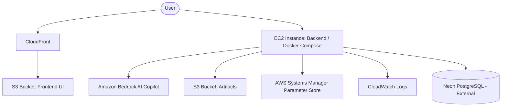

# FedGuard AWS Deployment Architecture

This document describes the Phase 14 cloud architecture for deploying FedGuard on AWS using a cost-safe, local-first topology.

## Target Architecture



## Why this Architecture?
We opted for a low-cost, maintainable architecture rather than complex Kubernetes or ECS Fargate deployments.
- **S3 + CloudFront** is virtually free and highly performant for static React assets.
- **EC2 + Docker Compose** allows us to port our exact local environment to a cloud VM for <$15/mo.
- **Neon PostgreSQL** provides a serverless database that avoids the $30/mo minimums of Amazon RDS.

## Deployment Instructions

### 1. Configure Parameter Store
Add your secrets to AWS Systems Manager Parameter Store:
- `/fedguard/dev/DATABASE_URL`
- `/fedguard/dev/JWT_SECRET`
- `/fedguard/dev/AWS_BEDROCK_MODEL_ID`

### 2. Deploy Frontend
```bash
cd frontend
npm run build
aws s3 sync dist/ s3://<your-bucket> --delete
aws cloudfront create-invalidation --distribution-id <id> --paths "/*"
```

### 3. Deploy Backend
1. Provision a `t3.small` EC2 instance using Amazon Linux 2023.
2. Assign an IAM Instance Profile granting SSM and S3 read/write.
3. SSH in and run `infrastructure/aws/scripts/ec2_bootstrap.sh`.
4. Run:
```bash
docker compose -f docker-compose.yml -f docker-compose.prod.yml up -d --build
```

### 4. Verify Prometheus/Grafana
Prometheus and Grafana are included in the production compose stack. Grafana will be available on port `3000`. Ensure your EC2 Security Group permits port `3000` from your IP address, or set up an NGINX reverse proxy.

### 5. Verify Bedrock
Make sure `LLM_PROVIDER=bedrock` is in the environment (or pulled from Parameter Store). Try asking the Copilot a question in the UI to ensure it resolves successfully.

## Rollback & Cleanup
If a deployment fails, use Git to revert to a stable tag, pull on EC2, and run `docker compose up -d --build`.

**To avoid surprise bills:** see [AWS Cost Safety](./AWS_COST_SAFETY.md).
